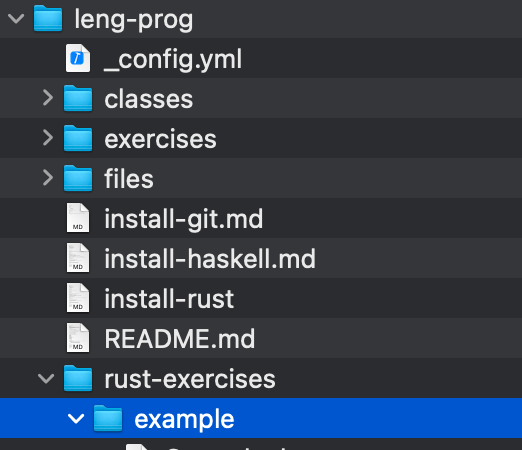

# How to Install Rust

### Mac OSX

#### Make sure you have brew installed
#### Install Rust
 ```shell
 >	brew install rust
 ==> Downloading https: ....
 ... etc
 ==> Pouring rust
 ....
 ```

### Windows & Others

[Install Rust](https://www.rust-lang.org/tools/install)

## Check it 

From the command line:

```shell
> cargo --version
cargo 1.x.x ....
```

If this fails, may be you have to modify your **PATH** variable

## Try your first project

### [Example](rust-exercises/example/README.md)
From the command line:

1. CD into the project directory:  `cd $PROJECTS/leng-prog/rust-exercises/example`
2. Run `cargo build`. It should compile OK.
3. Run `cargo test`. Tests should pass.
4. Run from command line (The binary is generated under **`target/debug`**):

```shell
> target/debug/example
Usage:
    hello <your name>
    oblique_shot <angle in degrees> <velocity in m/s>
    
> target/debug/example hello Newton
Hello Newton!

> target/debug/example oblique_shot 45 10
Range: 10.20m, Time: 2.55s
```

## IDE Support

### Install haskell Intellij plugin: (`Preferences/Plugins/Marketplace`) Search for *rust*.

### Open the example project:

#### 1.Click **Open** and select the **example** directory
 

It should open the project.

#### 2.Now you can run it.

* Check running `main` **(src/main/main.rs)**
* You can also create a **breakpoint** and run it with **debugger**
* Check running the test from the ide **(tests/example.rs)**
* Try debugging it
